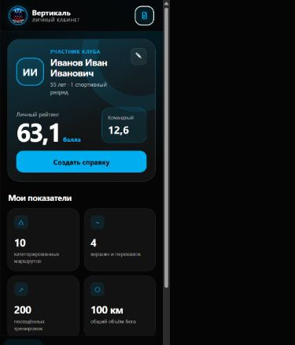

# Вертикаль

Мобильное приложение для участников ТСК «Вертикаль». Оно помогает хранить сведения о тренировках, походах, вершинах, тестах, соревнованиях и беге, автоматически рассчитывает личный и командный рейтинг и создаёт справку в Excel.

Приложение работает локально на устройстве пользователя и не требует отдельного сервера.

## Скачать

- **Android:** [скачать последнюю версию](https://github.com/Yl7oPoTblU/vertical-mobile-app/releases/latest)
- **Прямая ссылка на APK 2.1:** [Vertical-v2.1.apk](https://github.com/Yl7oPoTblU/vertical-mobile-app/releases/download/v2.1/Vertical-v2.1.apk)
- **Инструкция:** [`Как скачать и установить приложение`](./КАК_СКАЧАТЬ_ПРИЛОЖЕНИЕ.md)
- **Исходный код:** архив [`Вертикаль-исходники.zip`](./Вертикаль-исходники.zip)

Для установки APK на Android может потребоваться разрешить установку приложений из выбранного браузера или файлового менеджера.

## Авторство

Автор идеи, дизайна и требований проекта — **Yl7oPoTblU**. Техническая реализация выполнена при помощи OpenAI Codex.

Копирование, изменение и распространение приложения разрешены, в том числе для создания собственных версий, при обязательном указании автора оригинального проекта: **Yl7oPoTblU**. Подробные условия находятся в файле [`LICENSE.md`](./LICENSE.md).

## Основные возможности

- профиль участника и категории членства;
- личный и командный рейтинг;
- записи тренировок, маршрутов, вершин и перевалов;
- тесты, нормативы, соревнования и беговые треки;
- заметки и фотографии к записям;
- формирование справки в Excel;
- хранение и расчёты непосредственно на устройстве.

